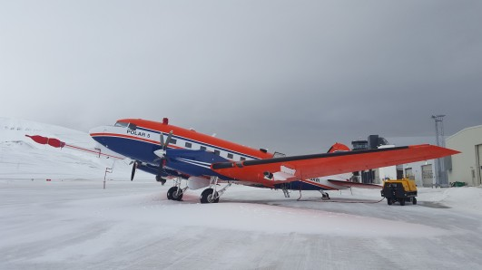

# Measurement Platforms
The (AC)³ project utilizes multiple measurement platforms.

## Airborne

::::{grid} 3

(halo-card)=
:::{card} 
:header: **HALO**
:link: /halo
:footer: Photo: Daniel Beckmann, DLR (CC BY-NC-ND 3.0)

 
:::

(polar5-card)=
:::{card}
:header: **Polar 5**
:link: /polar5

:::

(polar6-card)=
:::{card}
:header: **Polar 6**
:link: /polar6
:footer: Photo: Laura Köhler, AWI (CC BY-NC-ND 4.0)

:::

::::

## Ground Based

::::{grid} 3

:::{card} 
:header: **Title**
:link:

 
:::

::::

## Spaceborne

::::{grid} 3

:::{card} 
:header: **Title**
:link:

 
:::

::::

## Shipborne

::::{grid} 3

(polarstern-card)=
:::{card} 
:header: **RV Polarstern**
:link: /polarstern

 
:::

::::