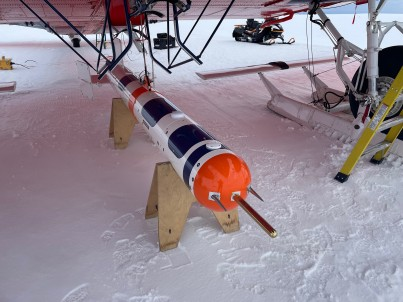

---
kernelspec:
    name: python
    display_name: Python 3
---
# T-Bird

Instrument paper: [](https://doi.org/10.5194/amt-18-3477-2025)

:::: {grid} 3
:::{card}
:footer: Photo: Laura Köhler (CC BY 4.0)

:::


::::

## Platforms

::::{grid} 3


::::

## Campaigns

::::{grid} 3


::::

## Data sets

```{code-cell} python
:tag: [remove-input]
from pathlib import Path
from pangaeapy import PanQuery 

keywords = ['project:AC3', 'T-Bird', 'Polar6']
query = ', '.join(keywords)
result = PanQuery(query)
dois = result.get_dois()

source = Path().resolve().parent
text = "\n".join(f"- []({doi})" for doi in dois)
build_folder = source / "_build/tmp"
build_folder.mkdir(exist_ok=True, parents=True)
_ = (build_folder / "tbird.txt").write_text(text)
```

```{include} ../_build/tmp/tbird.txt
```